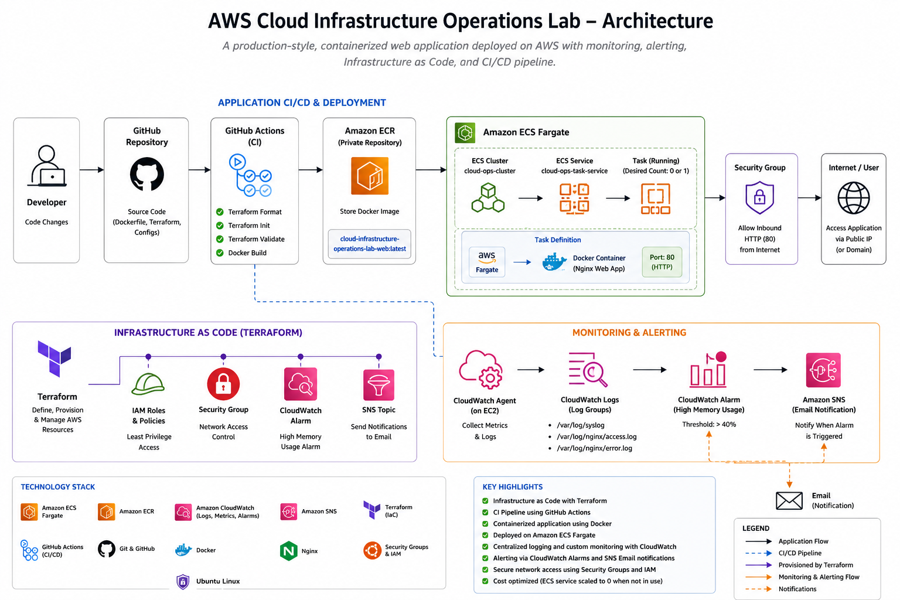
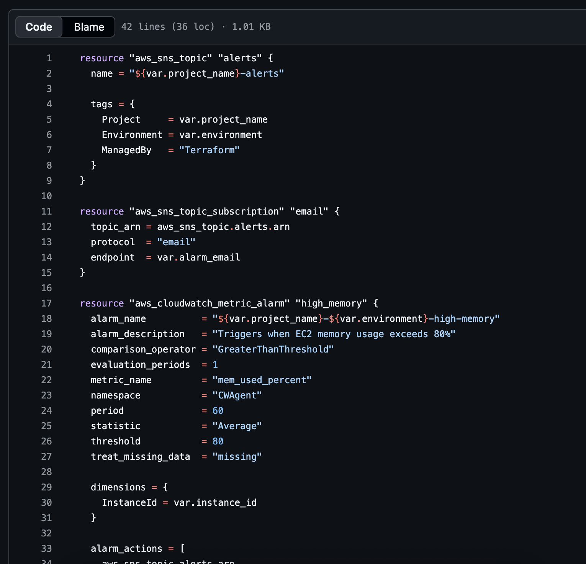
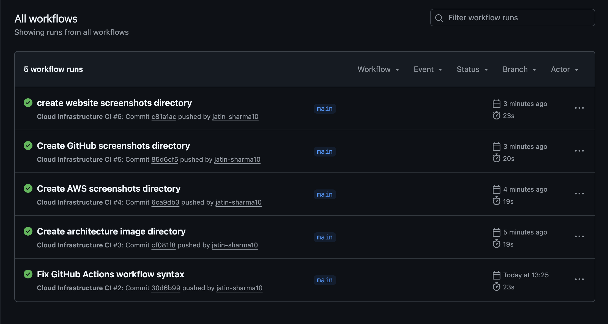
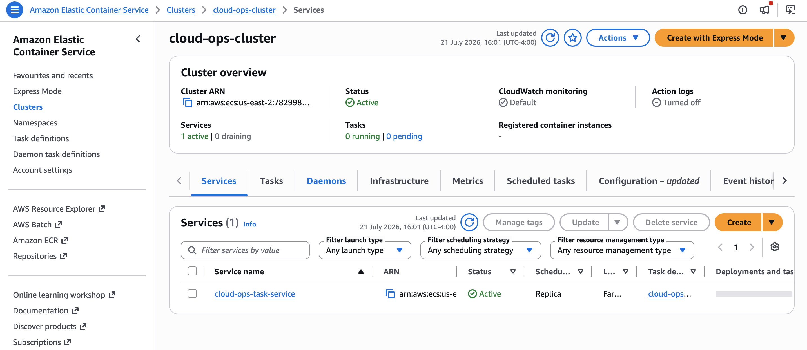
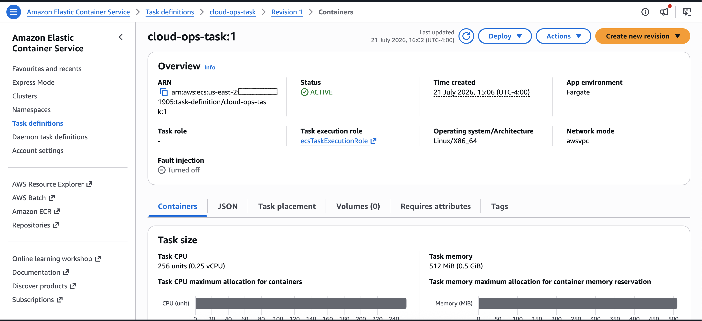
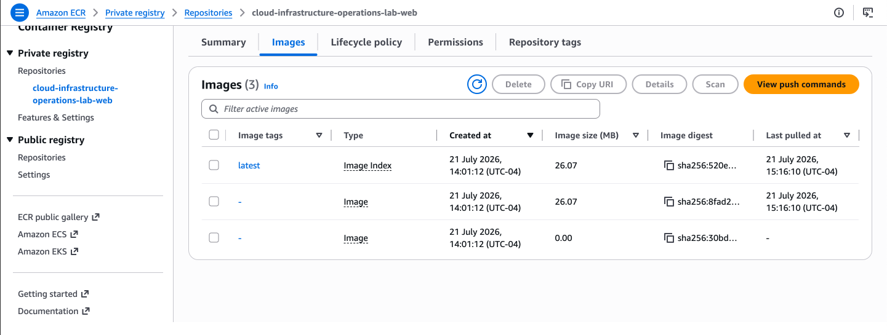
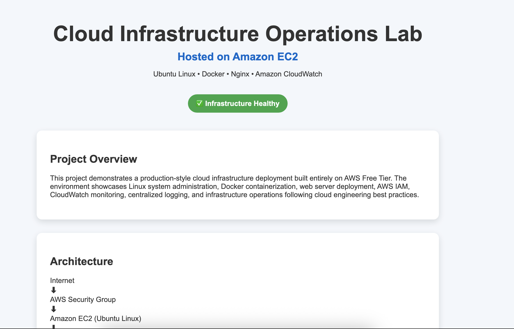
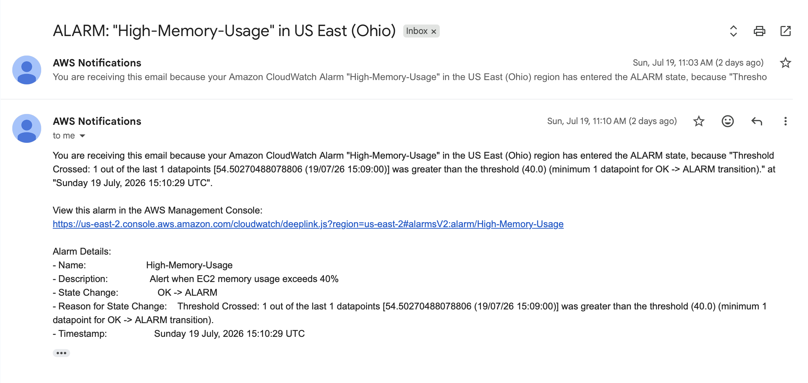

# AWS Cloud Infrastructure Operations Lab

A hands-on cloud infrastructure portfolio project demonstrating AWS operations, Linux administration, Docker containerization, Infrastructure as Code, CI validation, centralized monitoring, alerting, and Amazon ECS Fargate deployment.


---

## Project Status

The infrastructure was successfully deployed, tested, monitored, and documented.

To reduce unnecessary AWS usage after project completion:

- The Amazon EC2 instance was stopped.
- The Amazon ECS service was scaled to zero running tasks.
- Active alert notifications were disabled or removed.
- The Terraform code, Docker configuration, ECR image, ECS configuration, documentation, and screenshots were retained.

The environment can be reactivated for demonstrations or interviews.

---

## Project Overview

This project simulates responsibilities commonly performed by Cloud Infrastructure, Cloud Operations, Systems, and Junior DevOps engineers.

The project began with an Ubuntu Linux server running on Amazon EC2. Nginx was installed and configured to serve a custom web application. The application was then containerized with Docker and managed using Docker Compose.

AWS monitoring was implemented using the CloudWatch Agent, centralized log collection, custom memory metrics, alarms, and Amazon SNS email notifications.

Terraform was used to define AWS infrastructure components and validate Infrastructure as Code practices.

GitHub Actions was added to automatically run Terraform formatting and validation checks and verify that the Docker image could be built successfully.

The container image was published to Amazon Elastic Container Registry and deployed through Amazon ECS Fargate.

---

## Architecture



### Main Deployment Flow

```text
Developer
   │
   ▼
GitHub Repository
   │
   ▼
GitHub Actions
   │
   ├── Terraform format and validation
   └── Docker build verification
   │
   ▼
Amazon ECR
   │
   ▼
Amazon ECS Fargate
   │
   ▼
Security Group
   │
   ▼
Public Web Application
```

### Monitoring Flow

```text
EC2 / Application Logs
   │
   ▼
Amazon CloudWatch
   │
   ▼
CloudWatch Alarm
   │
   ▼
Amazon SNS
   │
   ▼
Email Notification
```

---

## Technologies Used

| Category | Technologies |
|---|---|
| Cloud Platform | Amazon Web Services |
| Compute | Amazon EC2, Amazon ECS Fargate |
| Container Registry | Amazon ECR |
| Containers | Docker, Docker Compose |
| Infrastructure as Code | Terraform |
| Operating System | Ubuntu Linux |
| Web Server | Nginx |
| Monitoring | Amazon CloudWatch |
| Notifications | Amazon SNS |
| CI | GitHub Actions |
| Version Control | Git and GitHub |
| Networking and Security | VPC, Security Groups, IAM |

---

## AWS Services Used

### Amazon EC2

Used an Ubuntu EC2 instance to practice:

- Linux server administration
- SSH access
- Package installation
- Nginx configuration
- Docker installation
- Docker Compose deployment
- CloudWatch Agent configuration

### Amazon ECR

Used Amazon Elastic Container Registry to:

- Create a private container repository
- Authenticate Docker with AWS
- Tag the local Docker image
- Push the image to AWS
- Store the application image for ECS deployment

### Amazon ECS Fargate

Used Amazon ECS Fargate to:

- Create a Fargate-compatible task definition
- Configure task CPU and memory
- Configure the container image from Amazon ECR
- Expose the application on port 80
- Create an ECS service
- Assign networking and security groups
- Run the container without managing an ECS host

### Amazon CloudWatch

Used Amazon CloudWatch to:

- Collect Linux system logs
- Collect Nginx access logs
- Collect Nginx error logs
- Publish memory utilization metrics
- Create a high-memory alarm
- Configure log retention
- Verify monitoring data

### Amazon SNS

Used Amazon SNS to:

- Create an alarm notification topic
- Subscribe an email address
- Receive a real CloudWatch alarm notification

### IAM

Used IAM roles and policies to support:

- EC2 monitoring
- CloudWatch Agent access
- Amazon ECR image operations
- Amazon ECS task execution
- ECS service-linked role operations

---

## Infrastructure as Code

Terraform configuration is stored in the:

```text
terraform/
```

directory.

The Terraform portion of the project demonstrates:

- AWS provider configuration
- Resource definitions
- Input variables
- Outputs
- Terraform formatting
- Terraform initialization
- Terraform validation
- GitHub Actions validation

### Terraform Code



---

## Containerization

The application is packaged with Docker using the repository's:

```text
Dockerfile
```

Docker Compose is used through:

```text
docker-compose.yml
```

The container configuration includes:

- Nginx web server
- Custom HTML application
- Port 80 exposure
- Container health check
- Repeatable container deployment

---

## Continuous Integration

The GitHub Actions workflow is stored at:

```text
.github/workflows/ci.yml
```

The workflow automatically performs:

1. Repository checkout
2. Terraform setup
3. Terraform formatting verification
4. Terraform initialization
5. Terraform validation
6. Docker image build verification

### Successful Workflow



---

## Deployment Workflow

The completed deployment process followed these steps:

1. Create and configure an Ubuntu EC2 instance.
2. Install Nginx and publish a custom web page.
3. Install Docker.
4. Build the application container image.
5. Configure Docker Compose.
6. Install and configure the CloudWatch Agent.
7. Send Linux and Nginx logs to CloudWatch.
8. Create a memory utilization alarm.
9. Configure Amazon SNS email notifications.
10. Define AWS infrastructure using Terraform.
11. Add automated checks through GitHub Actions.
12. Create an Amazon ECR repository.
13. Push the Docker image to Amazon ECR.
14. Create an ECS Fargate task definition.
15. Create an ECS service.
16. Configure security group access on port 80.
17. Run and verify the application through the task's public IP.
18. Scale down compute resources after testing.

---

## Deployment Evidence

### Amazon ECS Cluster and Service

The ECS cluster and service remain available while running tasks are scaled to zero to minimize cost.



### ECS Fargate Task Definition

The task definition is configured for Fargate using Linux, `awsvpc` networking, 0.25 vCPU, and 0.5 GiB of memory.



### Amazon ECR Repository

The application container image was successfully pushed to Amazon ECR.



### Initial EC2-Hosted Application

The following screenshot shows the initial application version hosted through the EC2-based deployment.



### SNS Alarm Notification

The CloudWatch memory alarm successfully triggered an Amazon SNS email notification.



---

## Repository Structure

```text
cloud-infrastructure-operations-lab/
├── .github/
│   └── workflows/
│       └── ci.yml
├── docs/
├── images/
│   ├── architecture/
│   │   └── architecture-diagram.png
│   ├── aws/
│   │   ├── cluster-ops-cluster.png
│   │   ├── ecr-repository.png
│   │   └── ecs-task-definition-overview.png
│   ├── github/
│   │   ├── github-actions-success.png
│   │   └── terraform-infrastructure-code.png
│   └── website/
│       ├── live-website.png
│       └── sns-alarm-email.png
├── terraform/
├── .gitignore
├── Dockerfile
├── LICENSE
├── README.md
├── docker-compose.yml
└── index.html
```

---

## Challenges and Troubleshooting

This project included troubleshooting several realistic cloud infrastructure issues:

- Corrected Linux Docker permission problems.
- Configured GitHub SSH authentication after HTTPS push issues.
- Corrected a GitHub Actions YAML error.
- Resolved Amazon ECR repository permission issues.
- Identified the IAM permission required to create an ECR repository.
- Troubleshot the Amazon ECS service-linked role.
- Configured ECS task networking and public IP access.
- Configured security group access for HTTP traffic.
- Verified CloudWatch Agent installation and operation.
- Verified log delivery and custom metric publication.
- Successfully triggered and received an SNS alarm notification.
- Resolved diverged Git branches using a safe Git rebase.

---

## Skills Demonstrated

- AWS infrastructure operations
- Amazon EC2 administration
- Amazon ECS Fargate
- Amazon ECR
- Docker
- Docker Compose
- Terraform
- GitHub Actions
- Linux administration
- Nginx
- IAM roles and policies
- VPC networking
- Security groups
- CloudWatch logs and metrics
- CloudWatch alarms
- Amazon SNS
- Git and GitHub troubleshooting
- Infrastructure cost management

---

## Cost Management

After the project was completed:

- The EC2 instance was stopped.
- The ECS service desired task count was changed to zero.
- Compute charges were minimized.
- Project configurations and deployment evidence were retained.
- The project can be reactivated when a live demonstration is required.

---

## Future Improvements

Potential future enhancements include:

- Provision the ECS and ECR environment fully through Terraform.
- Store Terraform state remotely in Amazon S3.
- Add Terraform state locking.
- Add an Application Load Balancer.
- Configure HTTPS with AWS Certificate Manager.
- Add automated image publishing to Amazon ECR.
- Add automated ECS deployment through GitHub Actions.
- Create CloudWatch dashboards.
- Add CPU, disk, and application error alarms.
- Deploy the application across multiple Availability Zones.

---

## Author

**Jatin Sharma**

AWS Certified Solutions Architect – Associate  
AWS Certified Cloud Practitioner